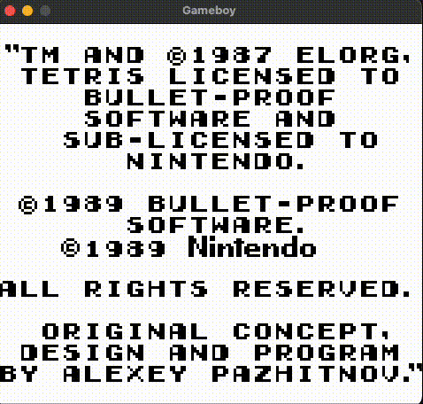
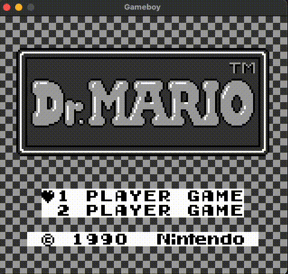
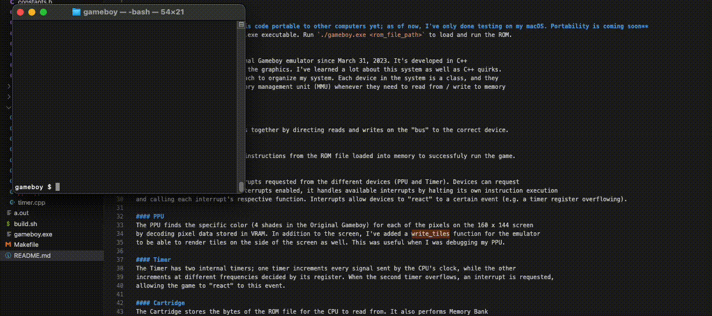

# Gameboy Emulator
I've used a bunch of emulators as a kid to play a variety of games from Kirby to Pokemon. It's always
been a mystery to me how they worked; this project provided good insight into the basic concepts of emulation.
The emulator is of the Original Gameboy and it currently supports games of ROM ONLY and MBC1 type (e.g. Tetris and Dr. Mario).

## Usage
**Disclaimer: I haven't made this code portable to other computers yet; as of now, I've only done testing on my macOS. Portability is coming soon**

Run `make` to build the gameboy.exe executable. Run `./gameboy.exe <rom_file_path>` to load and run the ROM.

## May 8, 2023
I've been working on this Original Gameboy emulator since March 31, 2023. It's developed in C++
with the help of SDL2 to render the graphics. I've learned a lot about this system as well as C++ quirks.
I used an Object Oriented approach to organize my system. Each device in the system is a class, and they
all communicate through the memory management unit (MMU) whenever they need to read from / write to memory
or other device registers.

## List of Devices
#### MMU or Bus
The MMU connects all the devices together by directing reads and writes on the "bus" to the correct device.

#### CPU
The CPU interprets the Gameboy instructions from the ROM file loaded into memory to successfuly run the game.

#### Interrupts
Interrupts handle various interrupts requested from the different devices (PPU and Timer). Devices can request
interrupts. When the CPU has interrupts enabled, it handles available interrupts by halting its own instruction execution
and calling each interrupt's respective function. Interrupts allow devices to "react" to a certain event (e.g. a timer register overflowing).

#### PPU
The PPU finds the specific color (4 shades in the Original Gameboy) for each of the pixels on the 160 x 144 screen
by decoding pixel data stored in VRAM. In addition to the screen, I've added a write_tiles function for the emulator
to be able to render tiles on the side of the screen as well. This was useful when I was debugging my PPU.

#### Timer
The Timer has two internal timers; one timer increments every signal sent by the CPU's clock, while the other
increments at different frequencies decided by its register. When the second timer overflows, an interrupt is requested,
allowing the game to "react" to this event.

#### Cartridge
The Cartridge stores the bytes of the ROM file for the CPU to read from. It also performs Memory Bank
switching for games that are not ROM only (currently only MBC1).

#### Joypad
The Joypad gets user input from the keyboard and transforms it into bits that can be
interpretted by other devices so they understand which buttons are pressed.

## Gameboy Tests Passed

#### Blargg Test ROMS -- cpu_instrs/individual
This passes all of Blargg's cpu_instrs/individual tests [here](https://github.com/retrio/gb-test-roms)

#### Matt Currie's dmg-acid2
This passes dmg-acid2 PPU test [here](https://github.com/mattcurrie/dmg-acid2)

#### Mooneye MBC1
This passes some MBC1 tests (haven't implemented more than 32 memory banks yet) [here](https://github.com/Gekkio/mooneye-gb)

